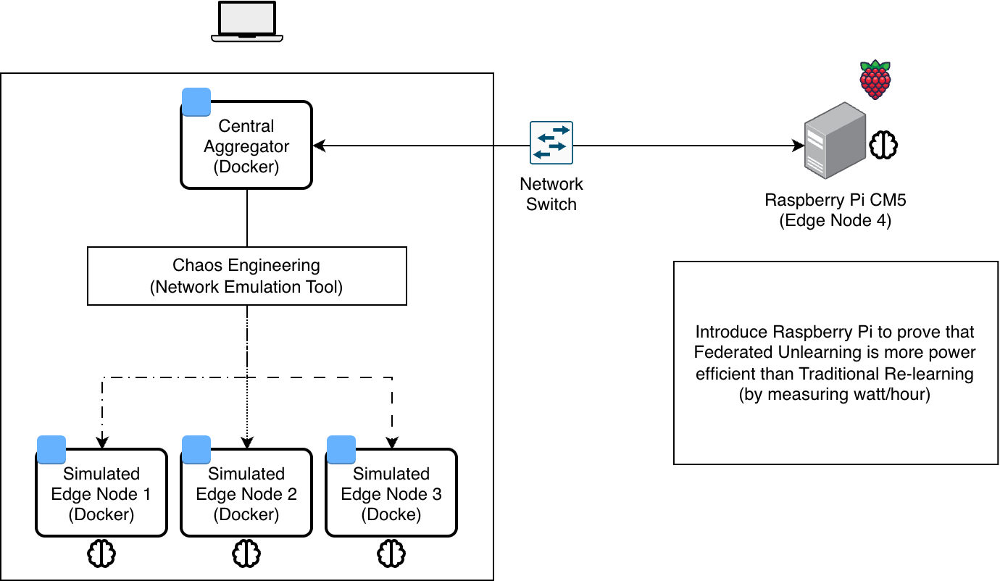
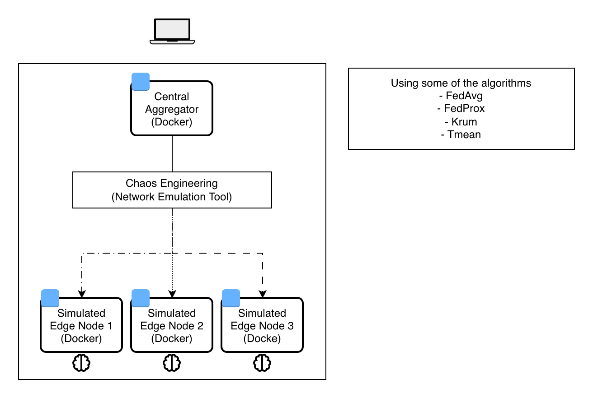
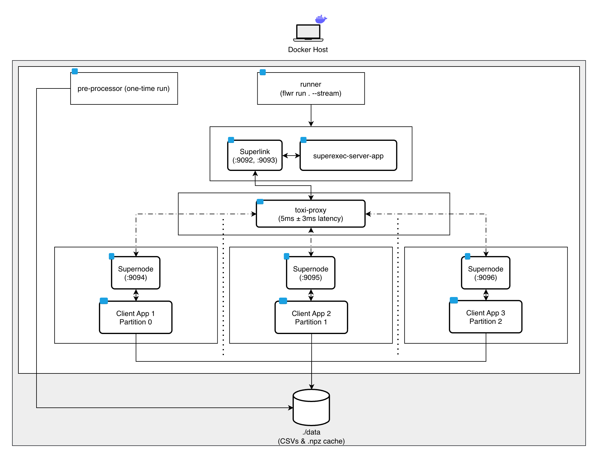

# Master Thesis — Distributed AI for IoT Network Attack Detection

MSc thesis on Federated Learning for intrusion detection across IoT edge nodes, extended with a physical-edge experiment comparing **Naive Retraining** vs. **SISA machine unlearning** after a data-poisoning attack.

The FL system is built with [Flower](https://flower.ai) 1.29.0 and PyTorch on the [TON_IoT](https://research.unsw.edu.au/projects/toniot-datasets) dataset. The course-assignment phase of this work (simulation-only, all nodes in Docker) is preserved at the [`course-final`](../../releases/tag/course-final) git tag; its results live in `results/course/`.

**MSc hybrid topology** — three simulated edge nodes on the host, the Raspberry Pi joining over the LAN as the 4th edge node:



## Repository layout

| Directory | Description |
|---|---|
| `edge_nodes/` | ClientApp — local training, model, data pipeline, poisoning, SISA |
| `server/` | ServerApp — aggregation strategy and round configuration |
| `ansible/` | Raspberry Pi 5 edge-node provisioning |
| `experiments/` | MSc experiment: pre-registered protocol + runbook, data prep, cooldown gate |
| `analysis/` | Model evaluation and paired statistics for experiment results |
| `tests/` | Verification of the unlearning guarantee (rollback correctness, determinism) |
| `results/course/` | Course-phase results (FedAvg baseline + chaos, FedProx, Krum, TrimmedMean) |
| `results/msc/` | MSc experiment outputs |
| `docs/` | Architecture diagrams |

The MSc experiment (Naive Retraining vs. SISA machine unlearning after data
poisoning, measured on physical edge hardware) is fully specified in
[`experiments/protocol.md`](experiments/protocol.md) — hypotheses, design,
statistics, and the step-by-step runbook.

## Dataset

Download the **TON_IoT Network dataset** from [research.unsw.edu.au/projects/toniot-datasets](https://research.unsw.edu.au/projects/toniot-datasets) and place all 23 `Network_dataset_*.csv` files into `data/`. The CSVs are excluded from git (3.3 GB total).

## Quick start (all-local simulation)

**Course-phase architecture** — all nodes simulated in Docker on one machine:





Requires Docker Desktop with at least 12 GB memory allocated (Settings > Resources > Memory).

1. Download the dataset and place the 23 CSV files in `data/` (see above).
2. Build partition caches (run once):

   ```sh
   docker compose run --rm preprocessor
   ```

3. Start the federation:

   ```sh
   docker compose up
   ```

## Configuration

Set via environment variables in `docker-compose.yml`:

| Variable | Default | Description |
|---|---|---|
| `FL_STRATEGY` | `fedavg` | `fedavg` (weighted average), `fedprox` (proximal term for non-IID drift), `krum` (Byzantine-tolerant), `trimmedmean` (drops outliers) |
| `NUM_ROUNDS` | `10` | Federation rounds |
| `MIN_FIT_CLIENTS` | `3` | Clients required for training |
| `MIN_EVAL_CLIENTS` | `3` | Clients required for evaluation |
| `MIN_AVAILABLE_CLIENTS` | `3` | Clients required before starting |

## Physical edge node (Raspberry Pi 5)

The MSc experiment extends the federation with a Raspberry Pi 5 (4 GB, fanless, A1 SD card) joining over the LAN as a 4th node, alongside the three simulated nodes on the host. Provisioning is automated with Ansible.

### Bootstrap

1. Generate an SSH key and flash Raspberry Pi OS Lite with the flasher (add the public key).
2. Verify connectivity:

   ```sh
   ssh -i ~/.ssh/<generated-private-ssh-key> admin@rasp5node.local
   ```

3. Provision the node:

   ```sh
   cd ansible
   ansible-playbook -i inventory.ini setup_node.yaml --ask-become-pass
   ```

> **Passphrase-protected key?** Ansible connects over SSH non-interactively, so it can't prompt for a private key passphrase. If your key has one, run `ssh-add ~/.ssh/<generated-private-ssh-key>` first (once per shell session/agent restart) so `ssh-agent` holds the decrypted key — otherwise the playbook fails with `Permission denied (publickey)` even though the key is correctly authorized on the Pi.

The playbook applies experiment-specific tuning: APT timers stopped, swap disabled permanently (Debian 13's `rpi-swap` set to `Mechanism=none`), CPU governor locked to `performance`, Docker with local log rotation, and a RAM-based telemetry script (`~/msc-experiment/monitor.sh`) that logs to `/dev/shm` so telemetry never touches SD-card I/O metrics.
